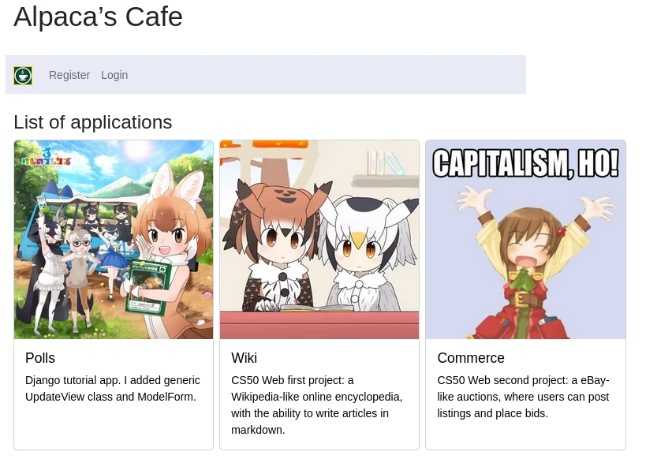
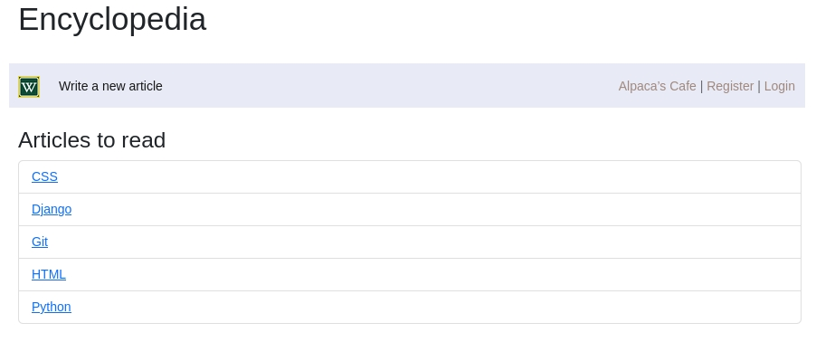
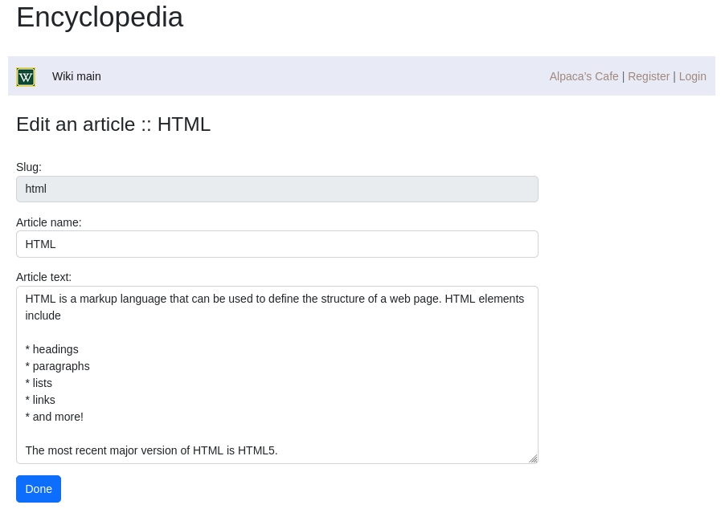
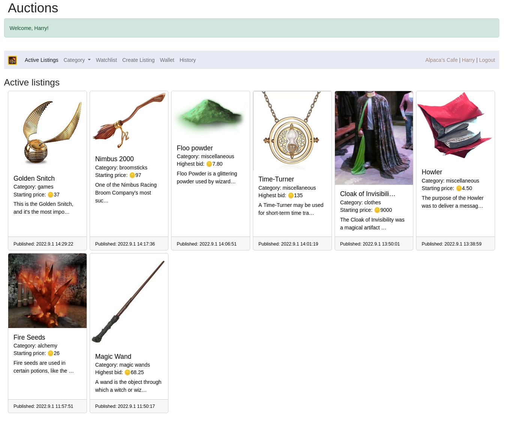
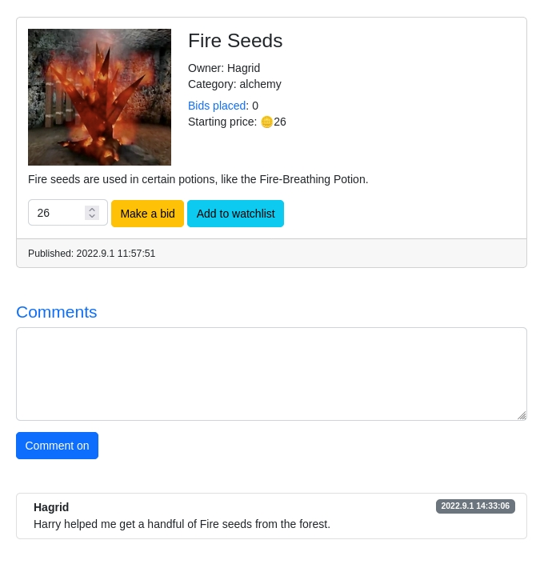
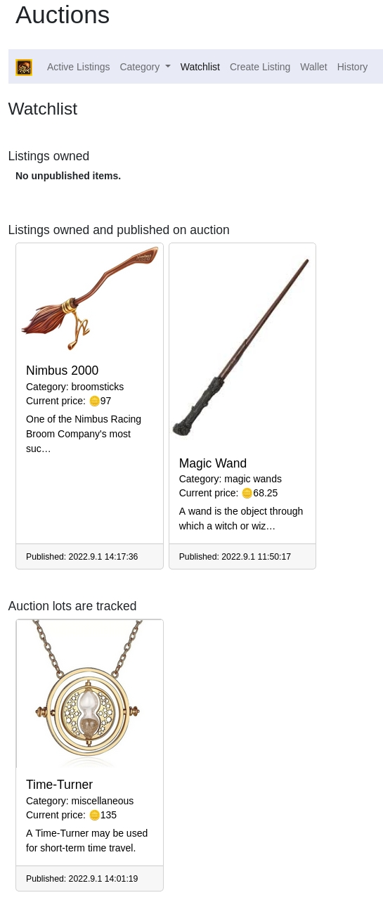
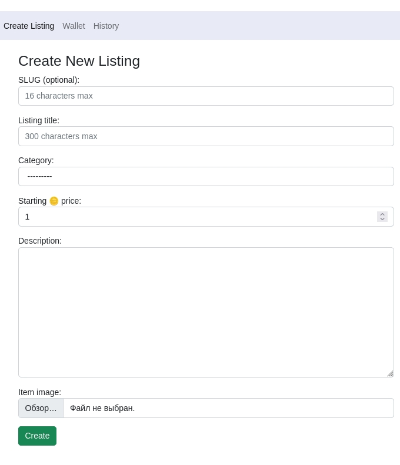
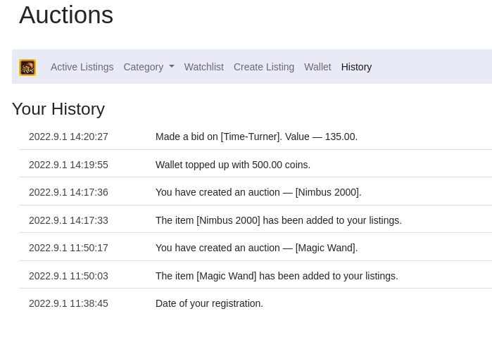
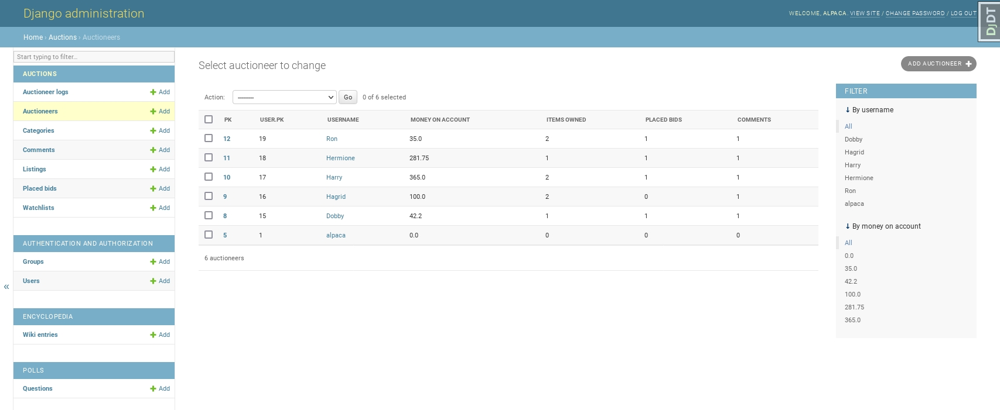
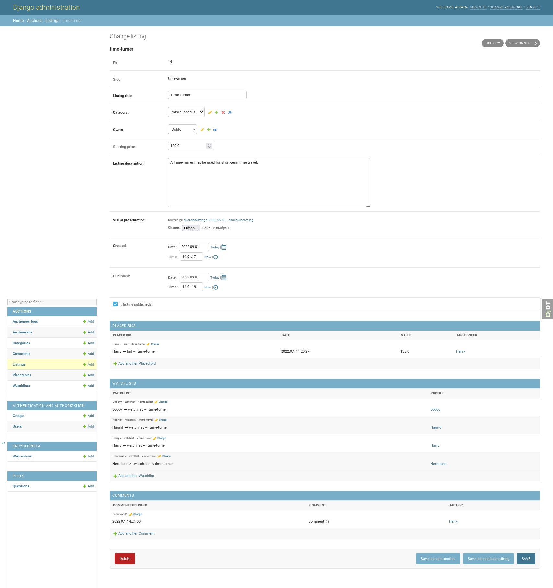

# Alpaca's Cafe

Django framework learning project.  
I had a lot of fun learning this framework. Thanks to him, I realized the importance of architectural patterns and learned many subtle nuances.  
The design was sketched using bootstrap, and the database is SQLite.  
I decided to use a separate database for each application and ran into a lot of difficulties, for which I have not yet grown up to the level.

#### The list of apps

* For the tutorial **Polls** app I added generic UpdateView class and ModelForm.

* 2nd app is the CS50 Web first project — **Wiki**. I used class based views and database instead of files.

* Then I wrote the **Accounts** app to register & loging/logout users. Along with base template layouts and automatic navbar.

* The **Core** app serves as an index and also stores tags and utilities that other applications may need. Thought out and wrote a logging system for the entire project.

* The CS50 Web second project — **Commerce**, is a eBay-like auctions app. It allows users to create auctions and bid. I approached this application thoroughly and wrote well thought out models, with lots of functions, instead of writing logic in views or forms. Actively used mixins for the first time.

* Fainally, I made an admin panels for each application.

* All functions, application components and resources I covered with tests.

###### Requirements: Pipenv https://pypi.org/project/pipenv/

###### In a terminal:

0. pipenv install
1. pipenv shell
2. python django-main/manage.py runserver
3. Running tests: python django-main/manage.py test %appname%

Administrator's name — **alpaca**, password — **qwerty**. All users password is **qwerty**.

##### Demo:

